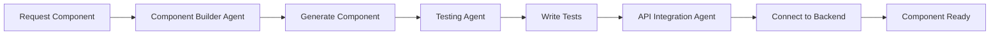

# Claude Code Agents for BeProductive Framework 🤖

## Overview
This directory contains specialized Claude Code agents designed to accelerate development, maintain quality, and ensure consistency across the BeProductive enterprise productivity framework.

## Available Resources

### 📚 UI/UX Resources Reference
**Comprehensive collection of UI/UX resources, component libraries, and design inspiration sites**

- **Component Libraries**: 20+ curated libraries from shadcn/ui to NextUI
- **Design Inspiration**: Mobbin, Dribbble, Awwwards, and more
- **Quality Assessment**: Scoring matrix and evaluation criteria
- **Resource Categories**: Icons, typography, colors, and development tools

**File**: [ui-resources-reference.md](./ui-resources-reference.md)

---

## Available Agents

### 🏗️ Component Builder Agent
**Purpose**: Automatically generate new UI components following established patterns

**Usage Example**:
```
"Create a notification center component with real-time updates, offline queue, and mobile optimization"
```

**Key Features**:
- React components with TypeScript
- shadcn/ui component structure
- Accessibility features (ARIA labels, keyboard navigation)
- Mobile responsiveness and touch optimization
- Integration with existing contexts and hooks

**File**: [component-builder-agent.md](./component-builder-agent.md)

---

### ✅ Testing & Quality Agent
**Purpose**: Maintain code quality and ensure comprehensive test coverage

**Usage Example**:
```
"Write comprehensive tests for the TaskManager component including unit tests, accessibility tests, and mobile responsiveness checks"
```

**Key Features**:
- Unit tests with Vitest and React Testing Library
- Integration tests for features
- Accessibility audits with axe-core
- TypeScript validation
- Mobile responsiveness testing
- Offline functionality validation

**File**: [testing-quality-agent.md](./testing-quality-agent.md)

---

### 🔌 API Integration Agent
**Purpose**: Handle API connections, data flow, and Supabase operations

**Usage Example**:
```
"Create a new API service for managing projects with offline sync, real-time subscriptions, and proper error handling"
```

**Key Features**:
- Supabase service layer creation
- Offline sync with IndexedDB
- Real-time subscriptions
- React Query hooks
- Error handling and retry logic
- File upload management

**File**: [api-integration-agent.md](./api-integration-agent.md)

---

### 🎨 Design Asset Discovery Agent
**Purpose**: Monitor UI/UX design trends and automatically discover new component libraries and patterns

**Usage Example**:
```
"Scan all monitored libraries for new navigation patterns with mobile optimization and generate adaptation recommendations"
```

**Key Features**:
- Monitors 20+ UI component libraries (shadcn/ui, Park UI, NextUI, etc.)
- Tracks design trends from Mobbin, Dribbble, Awwwards
- Automated component quality assessment
- Pattern recognition and trend analysis
- Component adaptation to framework standards

**File**: [design-asset-discovery-agent.md](./design-asset-discovery-agent.md)

---

## How to Use These Agents

### 1. Component Development Workflow



### 2. Quick Start Examples

#### Creating a New Feature Component
```
Agent: Component Builder
Task: "Create a team collaboration dashboard with:
- Real-time team member status
- Activity feed
- Task assignment widget
- Mobile-responsive layout
- Offline support"
```

#### Adding API Integration
```
Agent: API Integration
Task: "Create API service for team collaboration with:
- CRUD operations for team members
- Real-time status updates
- Activity logging
- Offline queue for actions"
```

#### Writing Tests
```
Agent: Testing & Quality
Task: "Write tests for team collaboration dashboard:
- Component rendering tests
- User interaction tests
- Real-time update tests
- Offline mode tests
- Accessibility compliance"
```

### 3. Agent Collaboration Pattern

Agents can work together on complex tasks:

1. **Component Builder** creates the UI structure
2. **API Integration** connects to backend services
3. **Testing Agent** ensures quality and coverage
4. **Performance Agent** optimizes the implementation
5. **Documentation Agent** updates the docs

### 4. Best Practices

#### When Creating Components:
- Always specify if mobile optimization is needed
- Include accessibility requirements upfront
- Mention any specific integrations required
- Specify if offline support is needed

#### When Setting Up APIs:
- Define the data structure clearly
- Specify real-time requirements
- Mention caching strategies needed
- Include error handling requirements

#### When Writing Tests:
- Specify coverage requirements
- Include performance benchmarks
- Mention specific user flows to test
- Request accessibility validation

## Framework Context

### Tech Stack
- **Frontend**: React 18.3.1, TypeScript, Tailwind CSS
- **UI Library**: shadcn/ui components
- **State Management**: React Context, Tanstack Query
- **Backend**: Supabase (PostgreSQL, Auth, Storage)
- **Testing**: Vitest, React Testing Library
- **Mobile**: PWA, Touch optimization, Offline support

### Project Structure
```
src/
├── components/       # UI components
│   ├── ui/          # Base UI components (shadcn)
│   ├── mobile/      # Mobile-specific components
│   └── [feature]/   # Feature-specific components
├── contexts/        # React contexts
├── hooks/           # Custom hooks
│   ├── api/        # API hooks
│   └── ui/         # UI hooks
├── services/        # API services
├── integrations/    # External integrations
│   └── supabase/   # Supabase client and types
├── utils/          # Utility functions
├── types/          # TypeScript types
└── pages/          # Page components
```

### Key Design Patterns

#### Component Pattern
```typescript
// Functional component with TypeScript
export function ComponentName({ prop }: Props) {
  // Hooks at the top
  const { user } = useAuth();
  const { isMobile } = useMobile();

  // Event handlers
  const handleAction = () => {};

  // Conditional rendering
  if (loading) return <Loading />;
  if (error) return <Error />;

  // Main render
  return <div>...</div>;
}
```

#### Service Pattern
```typescript
// Singleton service class
class ServiceName {
  private static instance: ServiceName;

  static getInstance() {
    if (!this.instance) {
      this.instance = new ServiceName();
    }
    return this.instance;
  }

  async method() {
    // Implementation
  }
}
```

#### Hook Pattern
```typescript
// Custom hook with React Query
export function useResource() {
  return useQuery({
    queryKey: ['resource'],
    queryFn: fetchResource,
    staleTime: 5 * 60 * 1000,
  });
}
```

## Common Tasks

### Add a New Module
1. Create component structure with Component Builder Agent
2. Set up API endpoints with API Integration Agent
3. Write tests with Testing Agent
4. Add to navigation and routing
5. Update module configuration

### Implement Offline Support
1. Use API Integration Agent to add IndexedDB storage
2. Implement sync queue for actions
3. Add offline status indicators
4. Test offline scenarios

### Add Real-time Features
1. Set up Supabase real-time subscriptions
2. Implement optimistic updates
3. Add connection status monitoring
4. Handle reconnection logic

### Mobile Optimization
1. Use Mobile & PWA Agent for touch optimization
2. Implement responsive layouts
3. Add gesture support
4. Ensure 44px minimum touch targets

## Tips for Agent Usage

### Be Specific
Instead of: "Create a dashboard"
Use: "Create an analytics dashboard with real-time metrics, chart visualizations, date range filtering, and mobile-responsive layout"

### Provide Context
Include information about:
- User roles and permissions
- Data structures
- Integration requirements
- Performance constraints

### Request Complete Solutions
Ask agents to include:
- Error handling
- Loading states
- Empty states
- Accessibility features
- Mobile considerations

### Chain Agent Tasks
For complex features:
1. Design with Component Builder
2. Connect with API Integration
3. Test with Testing Agent
4. Optimize with Performance Agent
5. Document with Documentation Agent

## Troubleshooting

### Common Issues

#### TypeScript Errors
- Ensure all props have proper interfaces
- Check import paths are correct
- Verify type exports from services

#### Test Failures
- Mock external dependencies properly
- Use proper async/await in tests
- Clear mocks between tests

#### API Integration Issues
- Check Supabase RLS policies
- Verify authentication tokens
- Ensure proper error handling

#### Mobile/PWA Problems
- Verify service worker registration
- Check offline storage limits
- Test on actual devices

## Contributing New Agents

To add a new agent:
1. Create a markdown file in this directory
2. Follow the existing agent template structure
3. Include:
   - Purpose and capabilities
   - Tech stack knowledge
   - Code templates
   - Usage examples
   - Best practices
4. Update this README with the new agent

## Support

For questions or improvements to these agents:
1. Review existing agent documentation
2. Check the framework codebase for patterns
3. Test generated code thoroughly
4. Provide feedback for agent improvements

---

## Quick Reference

### Import Shortcuts
```typescript
// Common UI components
import { Button, Input, Card } from '@/components/ui';

// Hooks
import { useAuth, useMobile, useOfflineSync } from '@/hooks';

// Services
import { taskService, goalService } from '@/services';

// Types
import { Task, Goal, User } from '@/types';
```

### Testing Shortcuts
```bash
# Run all tests
npm test

# Run with coverage
npm run test:coverage

# Test specific file
npm test ComponentName

# Run in watch mode
npm run test:watch
```

### Development Commands
```bash
# Start dev server
npm run dev

# Build for production
npm run build

# Run linting
npm run lint

# Type check
npx tsc --noEmit
```

Remember: These agents are tools to accelerate development, but always review and test the generated code to ensure it meets your specific requirements and maintains the high quality standards of the BeProductive framework.