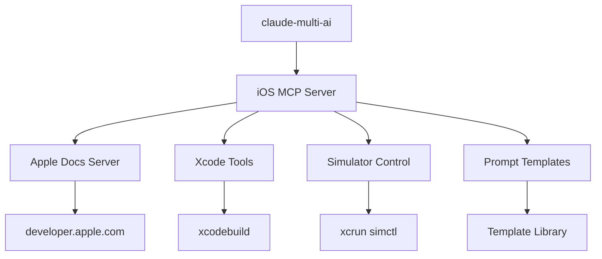

# 📱 iOS Development MCP Resource Library

A comprehensive Model Context Protocol (MCP) server that provides iOS development resources, Apple documentation access, and development workflow automation for AI-assisted iOS development.

## 🌟 Features

### 🍎 Apple Documentation Integration
- **Live SwiftUI Updates**: Real-time access to the latest SwiftUI changes and API updates
- **Xcode Release Notes**: Automatic fetching of Xcode release notes and new features
- **API Search**: Comprehensive search across Apple's developer documentation
- **Framework Documentation**: Access to SwiftUI, UIKit, Foundation, and more

### 🛠️ Development Tools
- **Xcode Automation**: Build, test, and archive iOS projects via command line
- **iOS Simulator Control**: Programmatic control over iOS simulators
- **Code Generation**: AI-powered Swift and SwiftUI code generation
- **Project Analysis**: Architecture analysis and improvement suggestions

### 📝 Prompt Templates
- **Swift Development**: Code generation, debugging, optimization prompts
- **SwiftUI Components**: UI component creation and customization
- **Architecture Patterns**: MVVM, VIPER, Clean Architecture guidance
- **Performance Optimization**: Memory management, CPU usage, battery efficiency
- **Testing Strategies**: Unit testing, UI testing, integration testing

### 🔗 MCP Integration
- **Compatible with claude-multi-ai**: Seamless integration with existing AI toolchain
- **Standard MCP Protocol**: Works with any MCP-compatible client
- **Tool Discovery**: Automatic tool registration and capability discovery
- **Error Handling**: Comprehensive error handling and logging

## 🚀 Quick Start

### Installation

```bash
cd ios-development-mcp
npm install
npm run build
```

### Register with claude-multi-ai

```bash
# Register the MCP server
node dist/index.js register

# Or manually integrate
claude-multi-ai --add-mcp-server ios-development --server-path ./dist/index.js
```

### Test the Integration

```bash
# Test Apple documentation access
node dist/index.js test

# Start the server
node dist/index.js start
```

## 📋 Available Tools

### Apple Documentation Tools

#### `apple_docs_search`
Search Apple's developer documentation for APIs, tutorials, and guides.

```json
{
  "query": "Button SwiftUI",
  "framework": "SwiftUI",
  "apiType": "struct"
}
```

#### `get_swiftui_updates`
Get the latest SwiftUI updates and changes from Apple.

```json
{
  "version": "6.0"
}
```

#### `get_xcode_release_notes`
Fetch Xcode release notes and new features.

```json
{
  "version": "16.0"
}
```

### Development Tools

#### `xcode_build`
Build iOS projects using xcodebuild command.

```json
{
  "projectPath": "./MyApp.xcodeproj",
  "scheme": "MyApp",
  "configuration": "Debug",
  "action": "build"
}
```

#### `simulator_control`
Control iOS Simulator operations.

```json
{
  "action": "boot",
  "deviceId": "iPhone 15 Pro"
}
```

#### `generate_swift_code`
Generate Swift code with specified patterns and requirements.

```json
{
  "language": "swift",
  "framework": "SwiftUI",
  "pattern": "MVVM",
  "description": "User profile view with edit functionality"
}
```

### Prompt Templates

#### `generate_ios_prompt`
Generate iOS development prompts using templates.

```json
{
  "templateId": "swift-code-generator",
  "userInput": "Create a network service for API calls",
  "context": {
    "targetiOSVersion": "15.0+",
    "architecturePattern": "MVVM"
  }
}
```

#### `list_ios_templates`
List all available iOS development prompt templates.

```json
{
  "category": "swift-development"
}
```

## 🏗️ Architecture

### Project Structure

```
ios-development-mcp/
├── src/
│   ├── apple-docs-server.ts      # Apple documentation API integration
│   ├── ios-mcp-server.ts         # Main MCP server implementation
│   └── index.ts                  # Entry point and CLI
├── prompts/
│   └── ios-templates.ts          # iOS development prompt templates
├── types/
│   └── prompt-library.ts         # TypeScript type definitions
├── examples/                     # Usage examples
├── tools/                        # Development and sync tools
└── apple-docs/                   # Cached Apple documentation
```

### MCP Server Architecture



## 🎯 Prompt Templates

### Swift Development Templates

#### `swift-code-generator`
Generates high-quality Swift code with modern patterns and best practices.

**Use Cases:**
- Network service implementation
- Data model creation
- Custom view components
- Utility functions

**Example:**
```
Generate a network service for API calls with async/await pattern
```

#### `swiftui-component-creator`
Creates reusable SwiftUI components following Apple design principles.

**Use Cases:**
- Custom UI components
- Reusable view modifiers
- Animation implementations
- Accessibility-compliant views

**Example:**
```
Create a customizable card component with hover animations
```

### Architecture Templates

#### `ios-architecture-guide`
Provides guidance for implementing clean architecture patterns in iOS applications.

**Use Cases:**
- Project structure planning
- Architecture pattern selection
- Code organization strategies
- Scalability planning

### Performance Templates

#### `ios-performance-optimizer`
Optimizes iOS app performance for memory, CPU, and battery efficiency.

**Use Cases:**
- Memory leak detection
- CPU profiling analysis
- Battery usage optimization
- Launch time improvement

## 🔧 Integration with claude-multi-ai

### Automatic Registration

The iOS MCP server automatically integrates with the existing claude-multi-ai system:

```bash
# Located at: /Users/gabrielsotomorales/.local/bin/claude-multi-ai

# Register iOS development capabilities
claude-multi-ai --add-mcp-server ios-development-mcp
claude-multi-ai --load-prompts ios-templates.ts
claude-multi-ai --configure apple-docs-integration
```

### Enhanced Luna Prompt System

The iOS templates extend the existing Luna prompt system (`src/data/promptTemplates.ts`) with iOS-specific capabilities while maintaining the same structure and quality standards.

### Usage in Spark Bloom Flow

```typescript
// Integration with existing prompt system
import { IOS_PROMPT_TEMPLATES } from './ios-development-mcp/prompts/ios-templates';
import { PROMPT_TEMPLATES } from './src/data/promptTemplates';

const combinedTemplates = {
  ...PROMPT_TEMPLATES,
  ...IOS_PROMPT_TEMPLATES
};
```

## 📚 Examples

### Basic Usage

```typescript
import { iOSMCPServer } from './src/ios-mcp-server';

const server = await iOSMCPServer.create();

// Search Apple documentation
const request = {
  id: '1',
  method: 'apple_docs_search',
  params: {
    query: 'NavigationView SwiftUI',
    framework: 'SwiftUI'
  }
};

const response = await server.handleRequest(request);
console.log(response.result); // API search results
```

### Code Generation

```typescript
// Generate Swift code
const codeRequest = {
  id: '2',
  method: 'generate_swift_code',
  params: {
    language: 'swift',
    framework: 'SwiftUI',
    pattern: 'MVVM',
    description: 'User authentication flow with biometric support'
  }
};

const codeResponse = await server.handleRequest(codeRequest);
console.log(codeResponse.result.code); // Generated Swift code
```

### Xcode Automation

```typescript
// Build iOS project
const buildRequest = {
  id: '3',
  method: 'xcode_build',
  params: {
    projectPath: './MyApp.xcodeproj',
    scheme: 'MyApp',
    configuration: 'Release',
    action: 'archive'
  }
};

const buildResponse = await server.handleRequest(buildRequest);
console.log(buildResponse.result.success); // Build result
```

## 🧪 Testing

### Run Tests

```bash
npm test
```

### Test Apple Documentation Access

```bash
node dist/index.js test
```

### Manual Testing

```bash
# Start server in debug mode
node dist/index.js start --debug

# In another terminal, send test requests
echo '{"id":"1","method":"get_swiftui_updates","params":{}}' | node dist/index.js
```

## 📈 Performance

### Caching Strategy

- **Apple Documentation**: 1-hour cache for API responses
- **Prompt Templates**: In-memory caching with file watching
- **Build Results**: Temporary caching for incremental builds

### Optimization Features

- **Lazy Loading**: Templates loaded on-demand
- **Parallel Processing**: Concurrent Apple API requests
- **Response Compression**: Reduced payload sizes
- **Error Recovery**: Automatic retry with exponential backoff

## 🔒 Security

### Data Privacy

- **No Data Storage**: All requests processed in real-time
- **Local Processing**: No data sent to external services (except Apple)
- **Secure Credentials**: Support for encrypted API keys
- **Sandboxed Execution**: Isolated tool execution

### Network Security

- **HTTPS Only**: All external requests use HTTPS
- **Rate Limiting**: Prevents API abuse
- **Input Validation**: All inputs validated with Zod schemas
- **Error Sanitization**: No sensitive data in error messages

## 🗺️ Roadmap

### Version 1.1
- [ ] Offline documentation support
- [ ] Custom template creation UI
- [ ] Enhanced project analysis
- [ ] TestFlight automation

### Version 1.2
- [ ] App Store Connect integration
- [ ] Code review automation
- [ ] Performance monitoring
- [ ] Team collaboration features

### Version 2.0
- [ ] Visual interface for template management
- [ ] AI-powered code suggestions
- [ ] Integration with other development tools
- [ ] Multi-language support

## 🤝 Contributing

1. Fork the repository
2. Create a feature branch
3. Make your changes
4. Add tests for new functionality
5. Submit a pull request

### Development Setup

```bash
git clone <repository-url>
cd ios-development-mcp
npm install
npm run dev
```

### Template Contribution

New prompt templates should follow the existing structure:

```typescript
export const NEW_TEMPLATE: PromptTemplate = {
  id: 'unique-template-id',
  category: 'appropriate-category',
  name: 'Human Readable Name',
  description: 'Clear description of what this template does',
  // ... rest of template structure
};
```

## 📄 License

MIT License - see [LICENSE](LICENSE) file for details.

## 🙏 Acknowledgments

- **Apple Developer Documentation** for comprehensive API references
- **Model Context Protocol** for the standardized integration framework
- **Spark Bloom Flow** project for the foundational prompt template system
- **claude-multi-ai** for the extensible AI assistant platform

## 📞 Support

- **Issues**: [GitHub Issues](https://github.com/spark-bloom-flow/ios-development-mcp/issues)
- **Documentation**: [Wiki](https://github.com/spark-bloom-flow/ios-development-mcp/wiki)
- **Discussions**: [GitHub Discussions](https://github.com/spark-bloom-flow/ios-development-mcp/discussions)

---

**Built with ❤️ for the iOS development community**